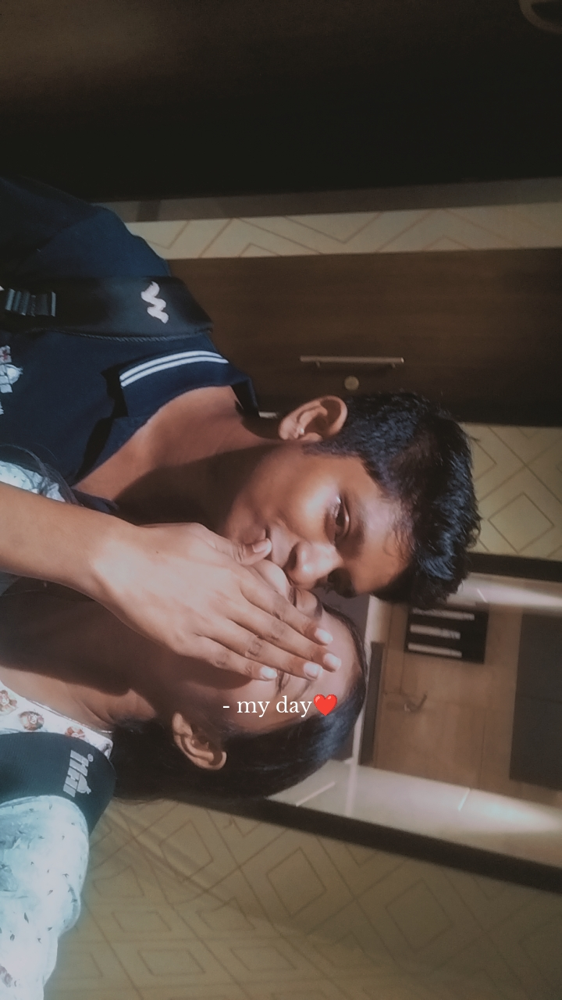
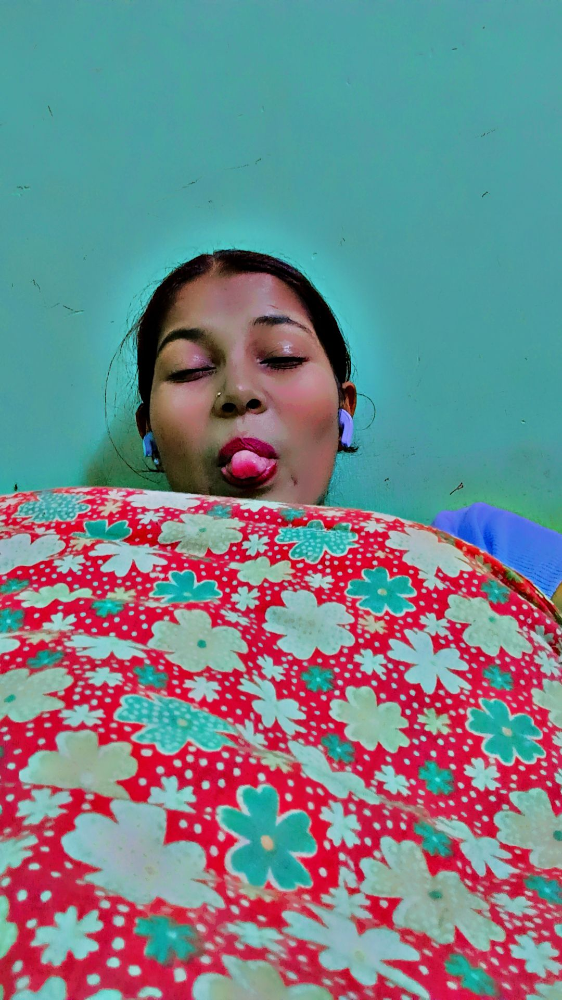
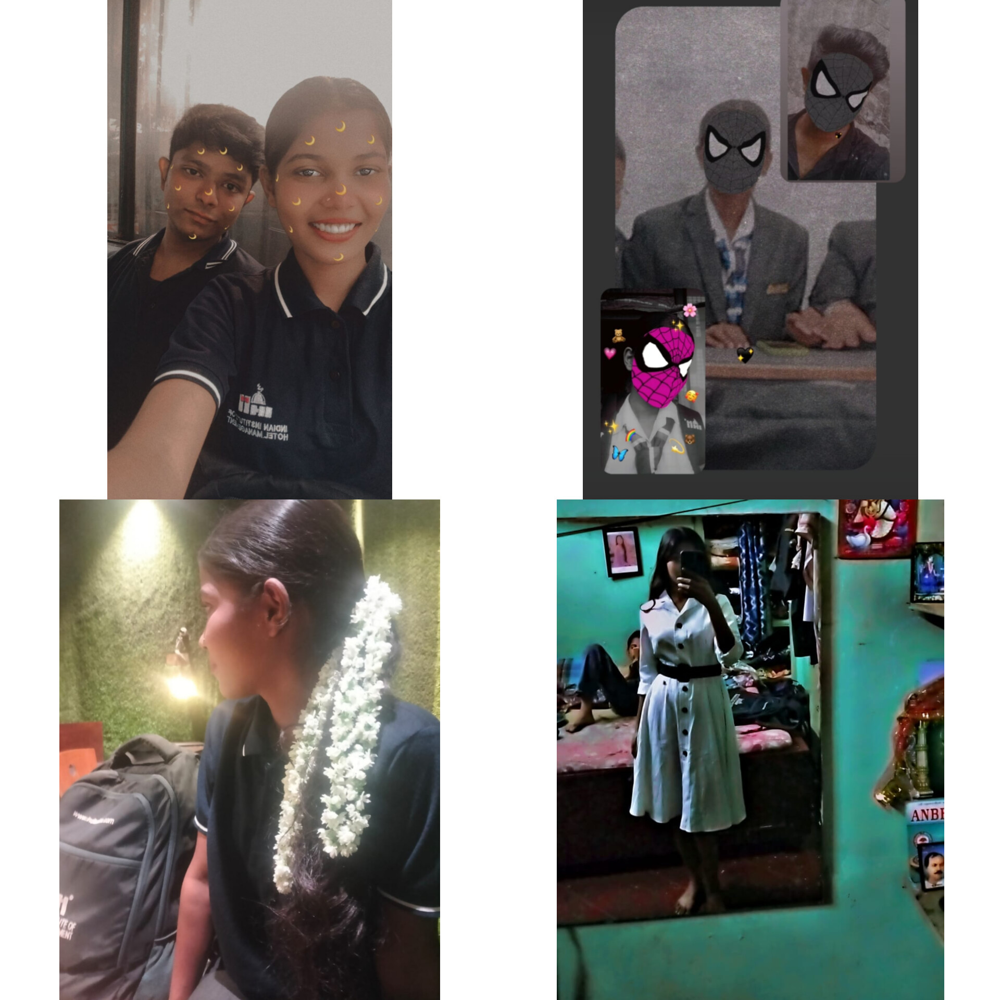
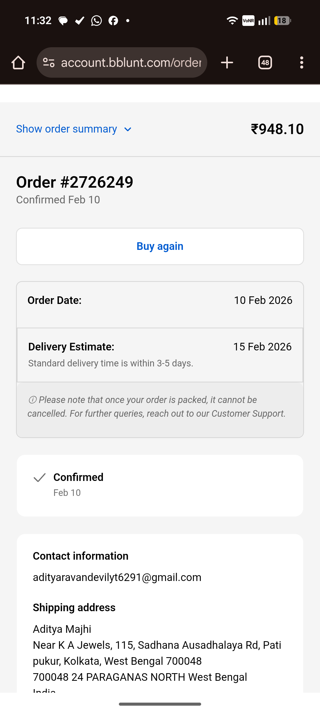
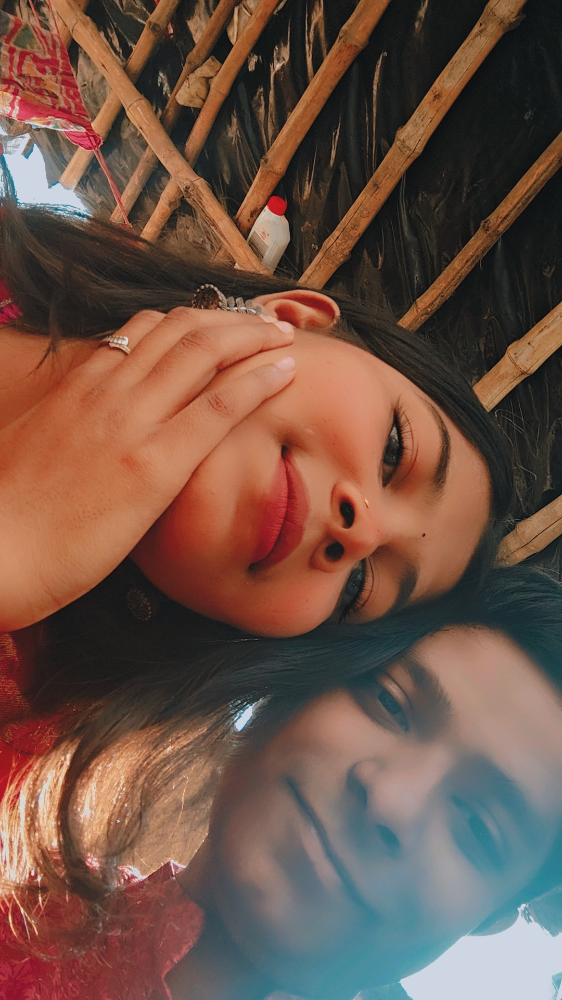
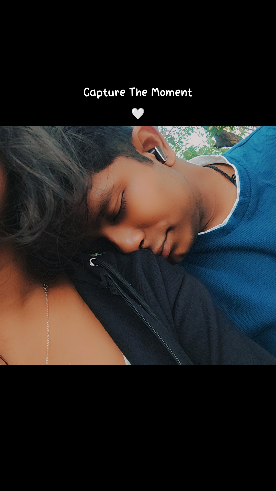

# Promise-day-
<!DOCTYPE html>
<html lang="en">
<head>
    <meta charset="UTF-8">
    <meta name="viewport" content="width=device-width, initial-scale=1.0">
    <title>Our Promise Day Journey</title>
    
</head>
<body>

    

        
SYSTEM REBOOTING...

        <button id="start-btn" class="btn" style="display:none;" onclick="startGame()">START GAME ✨</button>
    

    

        
Hearts Found: 0/2

        <h2 id="instruction">Catch 2 hearts to unlock my promises...</h2>
        
❤️

    

    

        <h2 style="color: var(--primary);">Our Journey So Far...</h2>
        

            
            
            
            
            
            
            
            
            
        

        

    

    
</body>
</html>
